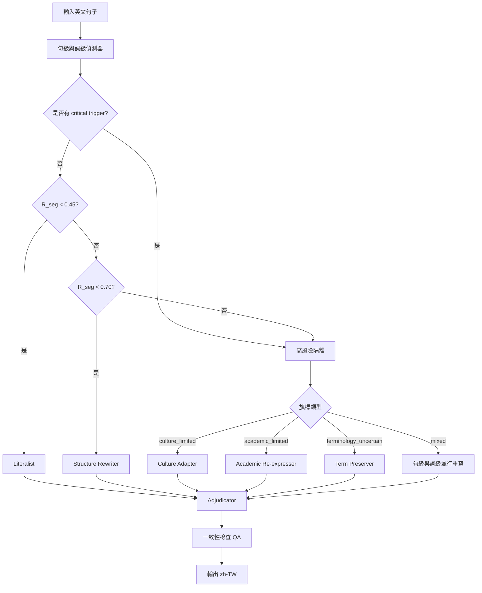
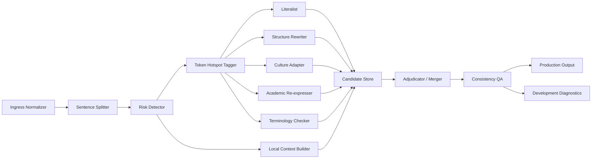

# 英譯台灣繁體中文流暢化 Agent Skill 設計研究報告

> **實作狀態**：本報告論證的「orchestrator + 窄職能子代理 + 整合者」架構，已落地為 SKILL.md 的**多代理模式**。可執行步驟見 `references/multi-agent-workflow.md`；翻譯子代理用的濃縮規格見 `references/condensed-rules.md`。本報告保留為學理依據。

## 目錄

| § | 主題 |
|---|---|
| [執行摘要](#執行摘要) | 核心建議與預設值總表 |
| [語言學與文化基礎](#語言學與文化基礎) | 英漢句法／語篇／語用差異 |
| [錯誤分類與自動診斷](#錯誤分類與自動診斷) | MQM 為骨架的錯誤類型與偵測規則 |
| [決策演算法與觸發規則](#決策演算法與觸發規則) | 句級／詞級 routing、風險分數、critical trigger |
| [Agent 技能架構](#agent-技能架構) | orchestrator＋子代理＋adjudicator、context 分層、JSON 契約 |
| [Prompt、few-shot 與評估](#promptfew-shot-與評估) | 各角色 prompt pattern、few-shot、評估指標 |
| [測試案例、開發路線圖與檢核表](#測試案例開發路線圖與檢核表) | 高風險測試樣例、五階段路線圖、實作檢核清單 |
| [參考文獻](#參考文獻) | 原始論文與專書 |

## 執行摘要

英語譯成台灣繁體中文時，「流暢」不只是把句子修順，而是要同時處理結構、語篇與語用三層的不對稱。中文雖然現代常態語序可視為 SVO，但長期被描述為高度受 topic-comment 組織影響的語言；它也大量依賴零照應、前置修飾、量詞系統與體標記，而英語則更依賴形式主詞、明示連接、代名詞鏈與時態形態。若系統採逐詞或逐短語對位，最常見的後果不是「小錯」，而是整句中文帶有英式尾修飾、代名詞過量、被動僵硬、連接詞過密、口氣失衡，讀者會感到「意思對了，但不像中文」。citeturn29view1turn38view0turn27view2turn27view3turn27view4turn32view0

就工程設計而言，最值得採用的不是單一大型 prompt，而是「LLM 主導 + 輕量規則偵測器 + 高風險片段隔離」的混合 skill。理由有三。第一，翻譯中文的失真點高度集中在少數高風險 token 與句段，像是 idiom、hedge、politeness marker、relative clause、dummy subject、culture-bound reference；把這些點單獨送往句級或詞級子代理重寫，往往比整段重寫更能降低上下文污染。第二，translated Chinese 可被可靠地和原生中文區分，且常殘留來源語 typological traces；這意味著「先做風險定位，再做局部去英文化」比「整段潤飾」更有針對性。第三，LLM 在長上下文中存在位置偏誤，對中段資訊的使用不穩定；因此應保留最小必要脈絡，而不是把所有中間草稿反覆塞回主模型。citeturn22view3turn39search3turn18view9turn18view10turn18view11

本報告的核心建議是：以 sentence-level detector 先做結構、文化、學術表達風險評分；高風險段再交由 sentence re-expression agent 與 token re-expression agent 分離處理，最後由 adjudicator 在「忠實度 > 術語一致性 > 文化/場合適切性 > 流暢度」的優先序下合併。評估層則以 COMET/xCOMET、COMETKiwi、TER/HTER 類編輯成本與抽樣 MQM 人評組合，而不是單靠 BLEU；近年的研究已顯示，僅靠傳統自動分數容易導致錯誤部署判斷，而具誤差定位能力的評估更適合拿來驅動 correction loop。citeturn25view0turn25view2turn18view7turn24search2turn36search14turn11search2turn18view6

下表是本報告建議的預設值。這些門檻不是文獻公定值，而是根據翻譯風險研究、MQM/error-span 評估文獻，以及長上下文與 iterative refinement 研究所做的工程化綜整。citeturn14search0turn25view0turn24search2turn24search3turn18view9turn18view10

| 項目 | 建議預設 |
|---|---|
| 目標語 | 台灣繁體中文 |
| 預設文體 | 中性偏正式；保留可依使用情境切換口語/正式/學術 |
| 核心方法 | LLM 主導 + 輕量規則偵測器 + 可選語法/術語工具 |
| 高風險處理 | 句級與詞級子代理隔離重表達，避免整段上下文污染 |
| 低風險策略 | literal translation 為主，只做必要在地化 |
| 中風險策略 | structural rephrasing 為主，搭配 pronoun pruning / aspect repair |
| 高風險策略 | cultural adaptation 或 paraphrase；不確定時保留原詞並加括註 |
| 評估預設 | COMET + xCOMET + COMETKiwi + 抽樣 MQM |
| 模式 | production：只輸出最終譯文；development：輸出 diagnostic JSON + 結構化子代理日誌 |
| 風險門檻 | 高風險 ≥ 0.70 或出現 critical trigger；中風險 0.45–0.69；低風險 < 0.45 |

## 語言學與文化基礎

英漢差異若只看「字詞對應」會失準，因為真正影響流暢度的是句法配置、信息打包方式與社會互動規則的不同。中文語法的權威描述一方面確認現代中文以 SVO 為典型語序，另一方面也指出 topic-comment construction 在中文中具有獨立地位；研究普遍接受中文可被視為 topic-prominent 或至少 topic-comment 傾向明顯的語言。這種特性使中文更容易接受主題先行、前置鋪陳與恢復性省略；相對地，英語較依賴明示主語與較嚴格的句法對位。citeturn31search9turn29view1turn40search6turn40search0

在形態與句法層面，中文動詞不為 tense、person、gender 或 number 屈折，但可帶體標記；中文同時有豐富量詞系統，relative clause 與多數修飾語位於名詞之前。這些差異直接影響英譯中時的句式決策：英文 tense 不應硬譯成中文時態，article 也不應機械對應，重點應轉成體、量、已知性與篇章資訊；而英語尾修飾與 heavy noun phrase 往往需重排成符合中文閱讀節奏的前置修飾或拆句形式。Packard 也進一步指出，中文不是「形態貧乏」，而是有不同的 morphology 設定與詞形成方式。citeturn27view2turn27view3turn27view4turn16search5turn27view7turn27view8

在語篇層面，中文與英語的主要差別不只是「有沒有連接詞」，而是關係是否必須被明說。Halliday 與 Hasan 把英語的 reference、conjunction、lexical cohesion 視為核心文本建構資源；中文則更常把部分關係留給語境推論、篇章延續與零照應處理。關於照應，中文被描述為大量使用 zero anaphora，且其解讀高度依賴脈絡與世界知識；相關研究甚至把 zero anaphora 視為中文 discourse 的常態。這正是英譯中常見的「英文很清楚、中文很累贅」的根源：如果英文每個 pronoun、conjunction、dummy subject 都被照單全收，中文就會變得不自然。citeturn32view0turn38view0

語用與文化差異則更直接地影響「是否像台灣中文」。Gu 對現代漢語禮貌現象的分析指出，中文禮貌不應簡單套用西方 polite speech 模型，而需考慮自身的面子與交談規範。Chen 的經典研究顯示，美式英語與中文說話者在回應讚美時採用的策略明顯不同：前者較受 agreement maxim 驅動，後者較受 modesty maxim 驅動。後續比較研究也反覆證明，儘管中英文共享某些面子和禮貌的普遍維度，文化對 speech-act performance 的影響仍然很大。對 request 而言，query preparatory modals 的跨語言、跨情境差異也十分顯著；而 House 與 Kádár 的對比語用研究則進一步指出，中英常規化表達與 speech act 的對應並不相同，在中文中某些表達與 speech act 的關係更直接，英語則更鬆動。citeturn18view2turn18view1turn32view5turn32view4turn32view3turn20search3

翻譯研究本身也提供兩個重要證據。第一，譯文不是中性的語碼轉換，其社會文化脈絡與 situational context 會影響品質判斷；House 的翻譯品質評估模型一再強調 socio-cultural 與 situational context 的重要性，並把 cultural filtering 視為 covert translation 的核心工具之一。第二，translated Chinese 經常留下 source-language traces，且英譯中 explicitness 的累積甚至可能回饋到中文使用本身；針對 translated Chinese 的機器學習研究顯示，譯文可與非譯文可靠區分，來源語型態差異也會殘留在中文譯文中。這些發現說明：流暢度問題不是單句 style polishing，而是跨層級的 recontextualization 工作。citeturn18view5turn33search4turn22view3turn39search3turn39search1

下表綜整上述文獻，將差異直接對映到英譯台灣中文的主要風險與處理方向。citeturn29view1turn38view0turn27view2turn27view3turn27view4turn32view0turn18view1turn18view2

| 層次 | 英語傾向 | 中文傾向 | 典型流暢度風險 | 建議預設處理 |
|---|---|---|---|---|
| 句法 | subject prominence、尾修飾、dummy subject、被動顯性 | topic-comment、前置修飾、主題鏈、省略可恢復成分 | 英式尾修飾、虛主詞直譯、被動僵硬 | 重排語序、刪除虛主詞、必要時主動化 |
| 形態 | tense、number、article 明示 | 以 aspect、量詞、語境解讀為主 | 時態與冠詞硬譯、量詞缺失 | 轉為體/量/已知性判斷 |
| 語篇 | pronoun/connective 較明示 | 零照應與推論較常見 | 代名詞過量、連接詞過密 | pronoun pruning、連接詞稀疏化 |
| 語用 | 較多 agreement-oriented polite routines | modesty、情境角色與關係敏感 | 口氣不對、請託/感謝/讚美失真 | speech-act 重建、禮貌等級重設 |
| 文化 | idiom、制度名、修辭框架常本地化 | 讀者以在地社會知識解讀 | 字面可理解但文化不通 | cultural adaptation 或保留原詞加註 |

## 錯誤分類與自動診斷

翻譯 error taxonomy 最實用的做法，不是從零造一套分類，而是以 MQM 的 Accuracy、Fluency、Terminology、Locale/Style 等高層類別為骨架，再加上英→台灣繁中專屬子類。MQM 的優點在於可保持對人評與自動評估的可對齊性；近年的大規模人評研究也正是以 MQM 為核心，並指出不用明確 error analysis 的評估流程很容易做出錯誤結論。citeturn18view6turn25view0

在英譯台灣繁中情境下，最值得優先偵測的其實不是所有錯誤，而是「最容易造成不自然且最便於局部修復」的錯誤。這類錯誤通常具有局部觸發點與可機器納管的訊號，例如：relative clause/participial modifier、dummy subject、過量 pronoun、過度 explicit conjunction、被動句、idiom/multiword expression、hedge/modal、honorific/request marker、culture-bound term、academic compression 與術語不一致。translated Chinese 研究已顯示來源語痕跡可穩定被抓到，因此設計自動診斷規則是有經驗基礎的；而 xCOMET、COMETKiwi 與 GEMBA-MQM 之類工具也說明了 sentence/word/span 級 error localization 是可行的。citeturn22view3turn39search3turn24search2turn36search14turn24search3

下表是建議採用的錯誤分類與自動檢測規則。表中的例句為本報告自建測試樣例；分類框架與檢測方向則依據上述語言學與評估文獻綜整。citeturn29view1turn38view0turn18view1turn18view2turn21search0turn22view3turn18view6

| 類型 | 問題樣貌 | 問題示例 | 自動診斷規則 |
|---|---|---|---|
| 結構直譯 | 英語尾修飾直接保留 | *報告，這是上週發布的，指出…* | 依存句法偵測 relative/participial clause；若 head noun 後有重修飾，標記 `needs_reorder` |
| 虛主詞殘留 | *it is clear / it is worth noting* 直譯成「它是清楚的」 | *它值得注意的是…* | 偵測 `it + be + adj/pp + that-clause`，轉為評論框架 |
| 代名詞過量 | 英語 pronoun 鏈逐一保留 | *如果使用者忘記他的密碼，他可以重設它* | 代名詞密度高且 antecedent 穩定時，標記 `pronoun_prune` |
| 體標記失衡 | 把 tense 當中文時態直譯 | *他已經在這裡工作了三年並且將會持續工作* | 偵測 perfect/progressive/modal 組合，改判 aspect 與時間副詞 |
| 冠詞/量詞硬映射 | `a/the` 直接譯出或漏量詞 | *一個資訊*、*那個研究* | 名詞類型 + 可數性詞典 + measure/classifier 規則 |
| 被動僵硬 | English passive 全保留為 被 | *這個決定被做出* | 偵測 passive；若 doer 無需凸顯且中文以主動更自然，標記 `voice_shift_candidate` |
| 連接詞顯化過度 | every because/and/however 都保留 | *而且…因此…然而…* | discourse marker 密度超門檻；若邏輯已由語序可恢復，標記 `connector_prune` |
| 禮貌/語用失真 | request/thanks/apology 口氣不合 | *請你現在把檔案傳給我*（原文其實委婉） | 偵測 modal、please、indirect request pattern、honorific marker |
| idiom/慣用語誤譯 | 字面可解，整體不通 | *移動球門柱* | idiom lexicon 命中或 compositionality 低，標記 `idiom_risk` |
| register 失衡 | 書面語太口語，或口語太書面 | *本研究超有料* / *小朋友請勿觸碰* 用在正式公告不當 | register lexicon + domain cue + audience brief |
| 學術 hedge 失真 | `may`, `suggest`, `appear`, `arguably` 被增強或消失 | *結果證明…*（原文 only suggests） | modal/hedge 詞表命中，標記 `hedge_preserve` |
| 文化/制度詞不透明 | 制度名、典故、比喻無對等 | *tenure-track*, *filibuster*, *on steroids* | NER/termbase 未命中且 culture lexicon 命中，標記 `culture_limited` |
| 嚴重意義錯誤 | omission/addition/hallucination | 無中生有的補述 | 對齊檢查 + reference-free QE/xCOMET critical span 偵測 |
| 術語不一致 | 同一術語多種譯名 | *模型* / *模形* / *機器模型* | term memory 比對，同文件一致性檢查 |

對「文化或學術能力有限」的辨識，最實用的不是抽象地問模型「你有沒有把握」，而是把風險拆成可觀測的旗標。建議設至少四類明確旗標：`culture_limited`、`academic_limited`、`terminology_uncertain`、`context_missing`。其中 `culture_limited` 應在 idiom、典故、制度詞、歷史指涉、幽默反諷、社會角色稱謂等命中時觸發；`academic_limited` 則在 hedge 密度高、專有術語未命中、理論名詞首次出現、或翻譯策略候選分歧很大時觸發。這些旗標本身不表示不能翻，而表示必須改走「隔離—重表達—保守合併」路線。citeturn14search0turn14search11turn24search2turn36search14

## 決策演算法與觸發規則

建議把策略選擇做成兩層：句級 routing 與詞級 hotspot routing。句級負責決定這一句主要應採 literal translation、structural rephrasing、cultural adaptation 還是 paraphrase；詞級則只標記哪些 token 或 multiword span 需要特殊處理，例如 idiom、hedge、entity、politeness marker、culture-bound term。這種雙層設計能把局部高風險從整句中剝離，避免低風險部分被過度重寫。其理論根據來自 translation risk management、span-level quality estimation 與長上下文位置偏誤研究；其工程優勢則在於可解釋、可回歸測試，而且成本可控。citeturn14search0turn24search2turn24search3turn18view9

句級風險分數可用下列加權式作為預設：

`R_seg = 0.25*結構風險 + 0.20*語用風險 + 0.15*語篇風險 + 0.15*文化風險 + 0.15*術語風險 + 0.10*模型不確定性`

其中模型不確定性若無 logprob，可用「候選差異度 + QE 低分 + 規則觸發數」代理。建議門檻為：低風險 `< 0.45`，中風險 `0.45–0.69`，高風險 `>= 0.70`。但若出現任何 critical trigger，應直接升為高風險，不受總分限制。critical trigger 的預設集合包括：idiom 字面翻譯明顯失真、academic hedge 可能被強化、制度詞未對齊、xCOMET/GEMBA 類工具標出 critical span、候選間 adequacy 判斷分裂、或 context 不足以確定 referent。這些都是工程建議值，不是學界標準 cut-off。citeturn24search2turn24search3turn25view0turn36search14

詞級 analysis 建議至少標八類 hotspot：`ENTITY`、`TERM`、`HEDGE`、`PRONOUN`、`IDIOM_PART`、`SPEECH_ACT_MARKER`、`DISCOURSE_MARKER`、`ASPECT_TIME_CUE`。如果 token 帶有多重標記，優先序應為 `ENTITY/TERM > HEDGE > IDIOM_PART > SPEECH_ACT_MARKER > PRONOUN > DISCOURSE_MARKER`。原因是術語與命名實體錯誤通常會傷害 adequacy，而 discourse marker 與 pronoun 問題多半屬 fluency 或 style 層級，可晚一些修。citeturn24search2turn36search14turn18view6

下表說明各策略的預設適用條件。citeturn29view1turn38view0turn18view1turn18view2turn35view0turn14search0

| 策略 | 何時優先 | 不宜優先的情況 | 建議做法 |
|---|---|---|---|
| literal translation | 專名、固定術語、風險低、語序差異小 | idiom、文化詞、英式尾修飾、虛主詞 | 先保留語義骨架，再做最少量 locale 修正 |
| structural rephrasing | relative clause、被動、dummy subject、nominalization、pronoun overload | 專有術語極密集且不能改動 | 重排語序、主動化、拆句、刪可恢復代名詞 |
| cultural adaptation | polite routine、speech act、idiom、文化比喻、制度詞 | 法規/合約需極高字面可追溯性 | 先保留交際功能，再找台灣中文自然等值 |
| paraphrase | 無自然對等、學術壓縮過重、比喻不共享、能力有限 | 可由術語表精準對應者 | 用明示語義換自然度；必要時加括註 |
| preserve source term | 學術名詞首次出現、制度詞或新興概念不確定 | 一般常見詞已有穩定譯名 | 中文譯名 + 原文括註，建立後續 term memory |

下圖是建議的句級決策流程。此流程特別把「文化/學術能力有限」設成明確分流，而不是讓主翻譯器自行含糊處理。citeturn14search0turn24search2turn36search14turn18view9



對使用者特別關心的「文化或學術角度能力有限」場景，本報告建議使用下列明確 flag 規則：

| 旗標 | 觸發條件 | 預設策略 |
|---|---|---|
| `culture_limited` | idiom/典故/制度詞/幽默/反諷命中；或文化詞覆蓋率 < 0.80 | 送文化子代理；若仍不穩定，採保守 paraphrase + 保留原詞 |
| `academic_limited` | 術語覆蓋率 < 0.85，且 hedge/claim cue 密度高；或候選對 claim strength 判斷分歧 | 送學術子代理；保留 hedge；必要時加原文術語 |
| `context_missing` | pronoun/ellipsis 無法穩定回指；或局部語境不足以確定指涉 | 互動模式請求補充；批次模式保守陳述，不擅自補全 |
| `terminology_uncertain` | 專名/術語不在 glossary；或同文件譯名衝突 | 維持 source form 或中文 + 原文括註，等待後續鎖定 |

## Agent 技能架構

建議把整個 agent skill 做成「單一 orchestrator + 多個窄職能子代理」而不是多個全能翻譯器競爭。後者雖然容易搭建，但會放大上下文重複、增加 attention drift，且每個候選都可能重新引入不同的風格與術語漂移。更穩定的做法是讓大模型先扮演 planner/detector，再把高風險局部送往專職子代理，最後由一個只讀結構化摘要與候選片段的 adjudicator 負責合併。這種設計吸收了 ReAct 的「推理與行動分工」、Self-Refine 的「多輪反饋修正」思想，同時用最小必要脈絡去迴避 long-context 的位置偏誤。citeturn18view11turn18view10turn18view9

下圖是建議的工作流程。citeturn18view11turn18view10turn18view9



子代理角色與介面可按下表實作。表中輸入/輸出是 message contract 的核心，而不是自然語言隨意交談；這樣做能降低 context bloat，也能讓測試與回歸更固定。citeturn18view9turn24search3turn36search14

| 子代理 | 核心任務 | 最小輸入 | 最小輸出 |
|---|---|---|---|
| Risk Detector | 估計句級風險與旗標 | source sentence、局部前後文、style brief | `risk_score`, `flags`, `recommended_strategies` |
| Token Hotspot Tagger | 標記需要特別處理的 span | source sentence、parse/lexicon hits | `token_labels`, `hotspots` |
| Literalist | 生成保守候選 | sentence、術語表、locale style | `candidate_text`, `confidence` |
| Structure Rewriter | 只處理結構自然化 | sentence、hotspots、局部前後文 | `candidate_text`, `applied_rules` |
| Culture Adapter | 處理語用、禮貌、idiom、文化比喻 | sentence、audience、register、culture flags | `candidate_text`, `culture_notes` |
| Academic Re-expresser | 處理 hedge、claim strength、學術壓縮 | sentence、domain hints、term memory | `candidate_text`, `hedge_preserved` |
| Terminology Checker | 鎖術語與 zh-TW 用詞 | candidate、glossary、file memory | `term_fixes`, `consistency_alerts` |
| Adjudicator | 選擇或融合候選 | candidates、flags、term fixes、scorers | `winner`, `merge_rationale`, `final_text` |
| Consistency QA | 檢查跨句一致性與 critical errors | final text、memory、QE signals | `qa_status`, `alerts` |

真正影響品質與成本的關鍵，不在「有幾個子代理」，而在 context 管理。建議把脈絡拆成四層。第一層是 `global brief`：目標地區、文體、讀者、禁止事項、術語表版本。第二層是 `segment packet`：當前句、前一句、後一句、前一輪已鎖定的 referent/term。第三層是 `decision memory`：只保留已採用譯名、人物稱呼、敬稱等結構化鍵值，不保留冗長草稿。第四層才是 `candidate store`，且僅保留 top-k 候選的摘要特徵，不把每個子代理的完整輸出再次餵給所有其他子代理。這種分層可直接降低「中間草稿污染最終判斷」的機率。citeturn18view9turn18view10

合併策略建議採「adjudicated rewrite」而不是單純 winner-take-all。因為 literalist 往往在專名與術語上最好，structure rewriter 在語序與代名詞裁剪上最好，culture/academic agent 則在語用與 claim strength 上最好；直接選一個全拿，常會犧牲另一面向。較穩定的順序是：先 term lock，再做 adequacy veto，再做 locale/register 選擇，最後才做 fluency 微調。若有衝突，優先序建議為：**事實與語義忠實 > 專名與術語一致 > 法規/醫療/學術風險控制 > 語篇連貫 > 風格流暢**。citeturn14search0turn25view0turn24search2

下表比較三種常見合併方法。citeturn18view10turn24search2turn25view0

| 合併法 | 優點 | 缺點 | 建議 |
|---|---|---|---|
| Winner-take-all | 最簡單、成本最低 | 容易失去其他候選的局部優點 | 不作預設，只適用低風險句 |
| Span voting/phrase merge | 可局部取長補短 | 容易破壞整句節奏與照應 | 只用於明確 hotspot |
| Adjudicated rewrite | 全句一致性最好，可明確套優先序 | 成本較高，需要好契約 | **建議預設** |

以下是建議的 JSON schema 與 mode 契約。這些 schema 的目的不是資料庫漂亮，而是讓子代理之間只交換最小必要訊息。若 development mode 要保留日誌，也建議保留結構化摘要，不保留冗長自由文本。citeturn18view9turn18view10

```json
{
  "TranslationRequest": {
    "source_text": "string",
    "target_locale": "zh-TW",
    "register": "neutral_formal | conversational | academic | marketing",
    "audience": "general | professional | academic",
    "mode": "production | development",
    "glossary": [{"source": "string", "target": "string"}],
    "document_memory": {
      "entities": [{"source": "string", "target": "string"}],
      "terms": [{"source": "string", "target": "string"}],
      "style_rules": ["string"]
    }
  }
}
```

```json
{
  "SegmentAnalysis": {
    "segment_id": "s12",
    "risk_score": 0.74,
    "flags": ["culture_limited", "terminology_uncertain"],
    "recommended_strategies": [
      "structural_rephrasing",
      "cultural_adaptation",
      "preserve_source_term"
    ],
    "token_hotspots": [
      {"span": "grade inflation on steroids", "label": "IDIOM_PART"},
      {"span": "grade inflation", "label": "TERM"}
    ]
  }
}
```

```json
{
  "ProductionOutput": {
    "translation": "string"
  },
  "DevelopmentOutput": {
    "translation": "string",
    "diagnostics": {
      "segment_id": "string",
      "risk_score": 0.0,
      "flags": ["string"],
      "applied_rules": ["string"],
      "candidate_scores": [
        {"agent": "literalist", "score": 0.81},
        {"agent": "culture_adapter", "score": 0.88}
      ]
    },
    "subagent_logs": [
      {
        "agent": "culture_adapter",
        "decision_summary": "string",
        "inputs_used": ["audience", "register", "hotspots"]
      }
    ]
  }
}
```

下面的 Python 偽程式碼說明 orchestrator 的最小流程。實作上可把 parser、termbase、QE 工具替換成任何可用元件；流程不依賴特定 runtime。 

```python
from dataclasses import dataclass
from typing import List, Dict, Any

@dataclass
class Candidate:
    agent: str
    text: str
    score: float
    meta: Dict[str, Any]

def translate_en_to_zh_tw(request: Dict[str, Any]) -> Dict[str, Any]:
    segments = split_into_segments(request["source_text"])
    memory = init_memory(request)
    outputs = []

    for idx, seg in enumerate(segments):
        local_ctx = build_local_context(segments, idx, memory)
        analysis = risk_detector(seg, local_ctx, request)

        candidates: List[Candidate] = []
        candidates.append(literalist(seg, local_ctx, request))

        if analysis["risk_score"] >= 0.45 or analysis["flags"]:
            candidates.append(structure_rewriter(seg, local_ctx, analysis, request))

        if "culture_limited" in analysis["flags"]:
            candidates.append(culture_adapter(seg, local_ctx, analysis, request))

        if "academic_limited" in analysis["flags"]:
            candidates.append(academic_reexpresser(seg, local_ctx, analysis, request))

        candidates = terminology_checker(candidates, memory, request)
        final = adjudicator(seg, local_ctx, analysis, candidates, request)

        qa = consistency_qa(final, seg, local_ctx, memory, request)
        final_text = apply_qa_fixes(final["text"], qa)

        update_memory(memory, seg, final_text, final, qa)
        outputs.append({
            "segment_id": f"s{idx}",
            "translation": final_text,
            "diagnostics": {
                "analysis": analysis,
                "qa": qa,
                "winner": final["agent"],
            } if request["mode"] == "development" else None
        })

    full_translation = stitch(outputs)
    if request["mode"] == "production":
        return {"translation": full_translation}
    return {
        "translation": full_translation,
        "segments": outputs,
        "document_memory": memory
    }
```

這段流程的關鍵，不是「多 agent」本身，而是只在需要時才啟動高成本子代理，且把 decision memory 做成結構化狀態，而不是讓每輪輸出彼此污染。這個設計方向與 long-context 研究和 iterative refinement 研究是一致的。citeturn18view9turn18view10turn18view11

## Prompt、few-shot 與評估

Prompt 設計應明確分離「診斷」、「候選生成」與「仲裁」三種任務。若把三者混在一個 prompt，模型往往會在還沒穩定完成風險辨識前就開始生成，然後用生成結果反過來合理化判斷。這在翻譯裡特別危險，因為一旦第一版譯文已帶入英式語序，後續 refinement 常只是局部修飾，而不是根本性重排。以結構化 JSON 先輸出風險與策略，再啟動生成器，通常比較穩定。citeturn18view10turn18view11

可直接採用以下 prompt pattern。

```text
[Detector System Prompt]
你是英→台灣繁體中文翻譯診斷器。
不要翻譯。只輸出 JSON。
任務：
1. 判斷 risk_score（0~1）
2. 標記 flags：culture_limited / academic_limited / terminology_uncertain / context_missing
3. 標記 token_hotspots
4. 在 literal_translation / structural_rephrasing / cultural_adaptation / paraphrase / preserve_source_term 中擇一或多個
5. 禁止輸出自由文本說明
```

```text
[Structure Rewriter Prompt]
你是結構重寫器，不負責創作。
目標：把英文句子重寫成自然的台灣繁體中文。
約束：
- 不新增、不刪除事實
- 可調整語序、切句、合句
- 可刪去中文可恢復的代名詞
- dummy subject 應轉為中文評論框架
- 保持已鎖定術語譯名
輸出：
{"candidate_text":"...", "applied_rules":["..."], "confidence":0.00}
```

```text
[Culture / Academic Adapter Prompt]
你負責處理 idiom、speech act、register、hedge 與文化詞。
約束：
- 先保留交際功能，再保留形式
- 若無穩定對等，採保守 paraphrase
- 專門術語不確定時，中文譯名後保留原文括註
- 嚴禁把 suggests / may / appears 升格為 proves / demonstrates
輸出：
{"candidate_text":"...", "applied_rules":["..."], "flags":["..."], "confidence":0.00}
```

```text
[Adjudicator Prompt]
你是仲裁器。
輸入：source、local_context、analysis、候選 A/B/C、term fixes、QA alerts
優先序：
1. adequacy
2. terminology consistency
3. cultural / register appropriateness
4. fluency
若最佳結果需融合多候選，輸出新的 final_text，並列出採用規則。
```

下面給兩組 few-shot，重點不是示範「答案」，而是示範何時該走哪條路。

**Few-shot 例一**

```text
Source:
Could you possibly send me the revised draft when you get a chance?

Detector output:
{
  "risk_score": 0.68,
  "flags": [],
  "recommended_strategies": ["cultural_adaptation"],
  "token_hotspots": [
    {"span": "Could you possibly", "label": "SPEECH_ACT_MARKER"},
    {"span": "when you get a chance", "label": "REGISTER"}
  ]
}

Best translation:
方便的話，麻煩你把修訂版草稿傳給我。
```

這一例的重點在於 requestive politeness 必須重建成台灣中文自然的委婉請託，而不是把 modal 與 adverb 逐字對位。中英 request modification 在跨語言、跨情境上有穩定差異，因此這類句子不宜只做 literal translation。citeturn32view4turn18view2turn20search3

**Few-shot 例二**

```text
Source:
The results may partly reflect sampling bias.

Detector output:
{
  "risk_score": 0.59,
  "flags": ["academic_limited"],
  "recommended_strategies": ["structural_rephrasing", "preserve_source_term"],
  "token_hotspots": [
    {"span": "may", "label": "HEDGE"},
    {"span": "partly", "label": "HEDGE"},
    {"span": "sampling bias", "label": "TERM"}
  ]
}

Best translation:
研究結果可能部分反映抽樣偏誤。
```

這一例的關鍵不是術語本身，而是不能把 `may partly reflect` 無意間翻強成「證明」或「顯示出明確因果」。學術翻譯裡，hedge preservation 比表面流暢更重要。citeturn35view0turn18view5turn14search0

評估方面，本報告不建議單押任何單一指標。BLEU 仍可作為 cheap regression guard，但已有大型研究指出，把它當唯一標準會阻礙更好模型的採用並造成不良部署決策。更穩妥的組合是：reference-based 用 COMET 做總體品質，xCOMET 做局部 error localization；reference-free 用 COMETKiwi 或 GEMBA-MQM 追蹤 sentence/word/span 級風險；若有人工資源，則抽樣做 MQM。BERTScore 與 chrF 可作附屬指標：前者可補語義相似度，後者在字符層回歸測試上成本低。TER/HTER 則適合衡量 post-edit 成本。citeturn25view2turn18view7turn24search2turn36search14turn24search3turn11search0turn10search3turn11search2

| 指標 | 類型 | 優點 | 主要盲點 | 建議用途 |
|---|---|---|---|---|
| BLEU | 參考譯文比對 | 便宜、成熟、易看趨勢 | 對中文自然度與文化妥適度感知弱 | regression guard，不作 release gate |
| chrF | 字符 n-gram | 對中文字符層變化敏感、成本低 | 不理解語用與文化 | 回歸測試與快速篩檢 |
| BERTScore | 嵌入語義相似 | 可捕捉表面詞形以外相似度 | 對 discourse / pragmatics 不夠敏感 | 輔助語義相似度 |
| TER / HTER | 編輯距離成本 | 接近 post-edit 工作量 | 需要參考譯文或人工目標譯文 | 人工後編成本預估 |
| COMET | 神經 MT 評估 | 與人評關聯高 | 多為整句分數，定位能力有限 | 主自動品質分數 |
| xCOMET | 可解釋神經評估 | 能找 localized critical errors / hallucinations | 成本較高 | 開發期錯誤定位 |
| COMETKiwi | reference-free QE | 可做句級與詞級品質估計 | 對文化 appropriateness 仍有限 | 批次掃描、上線監控 |
| GEMBA-MQM | LLM error-span 評估 | 可直接輸出 span 與 error type | 成本與穩定性受模型影響 | 開發期診斷，不建議單獨作 release gate |
| MQM | 人工分析評估 | 最可解釋，能對齊錯誤類型 | 成本最高 | 週期性抽樣 release gate |

人評 rubric 則建議至少保留四個面向，而且分開給分，不要混成一個總分。  
其一是 **adequacy**：核心命題、關係、否定與 hedge 是否忠實。  
其二是 **fluency**：是否像台灣中文，不帶明顯英式骨架。  
其三是 **cultural appropriateness**：speech act、idiom、register、稱謂與情境是否合宜。  
其四是 **consistency**：同文件內術語、稱呼、數字、標點與風格是否一致。  
若要做 release gate，建議將任何 `critical meaning error` 視為一票否決，其餘面向再做平均。這種做法比只看整體偏好分數更利於工程修正。citeturn25view0turn18view6turn24search2

## 測試案例、開發路線圖與檢核表

以下測試案例刻意涵蓋結構、語用、idiom、學術 hedge 與能力有限情境。例句與譯文為本報告自建，但應用規則直接對應前述文獻與工程規則。citeturn29view1turn38view0turn18view1turn18view2turn35view0turn14search0

| Source | 問題版直譯 | 改善版譯文 | 套用規則 | 為何觸發 |
|---|---|---|---|---|
| The committee, which was set up after the scandal, has yet to issue its report. | 委員會，這是在醜聞之後被設立的，還沒有發布它的報告。 | 這個委員會是在醜聞爆發後成立的，迄今仍未發布報告。 | `relative_clause_reorder` + `pronoun_prune` + `aspect_repair` | 英語尾修飾 + pronoun 過量 |
| It is worth noting that the proposal has yet to gain traction. | 它值得注意的是，這項提案還沒有得到牽引力。 | 值得注意的是，這項提案迄今仍未獲得足夠支持。 | `dummy_subject_drop` + `register_formalize` | 虛主詞 + 英式搭配 |
| If a user loses their password, they can reset it by email. | 如果一個使用者失去他們的密碼，他們可以藉由電子郵件重設它。 | 如果使用者忘記密碼，可透過電子郵件重新設定。 | `pronoun_prune` + `classifier_fix` + `lexical_nativize` | pronoun/calque |
| Could you possibly send me the file when you get a chance? | 你可能可以在你得到一個機會時把檔案寄給我嗎？ | 方便的話，麻煩你有空時把檔案傳給我。 | `speech_act_rebuild` + `register_adapt` | 委婉請託需重建 |
| The regulator keeps moving the goalposts. | 主管機關一直在移動球門柱。 | 主管機關一直在改變評判標準。 | `idiom_paraphrase` | 字面可懂但文化不通 |
| The findings may partly reflect Simpson's paradox. | 這些發現可能部分反映辛普森的悖論。 | 研究結果可能部分反映辛普森悖論（Simpson's paradox）。 | `hedge_preserve` + `preserve_source_term` | 學術風險；術語首次出現 |
| This policy is grade inflation on steroids. | 這項政策是打了類固醇的成績膨脹。 | 這項政策把成績膨脹推到更誇張的程度。 | `culture_limited` + `metaphor_paraphrase` | 文化比喻共享度低 |
| Thank you for your patience. | 謝謝你的耐心。 | 感謝您的耐心等候。 | `locale_register_adjust` | service-register 差異 |

若要把這套 skill 做成可持續演進的產品，開發路線圖可分成五個階段。

| 階段 | 目標 | 主要輸出 | 驗收標準 |
|---|---|---|---|
| 規格化 | 定義 zh-TW style guide、domain brief、flags、rules | 規格文件、術語表模板、annotation guide | 團隊對 error taxonomy 與 tone 一致 |
| 偵測層 | 上線句級/詞級 detector | rule sets、lexicons、risk JSON | 偵測召回率先高於精確率 |
| 生成層 | 實作 literal / structure / culture / academic 子代理 | prompt 契約、候選產生器 | 高風險句優於單一 prompt 基線 |
| 仲裁與 QA | 上線 adjudicator、term lock、QE gates | merge policy、QA alerts、monitoring | critical error 顯著下降 |
| 評估與部署 | 建立 dev/prod 流程與抽樣人評 | dashboard、A/B 測試流程、回歸集 | COMET/MQM 與人工偏好同步改善 |

實作前的檢核清單建議至少包含下列項目：

- 是否已明確定義預設 locale 為台灣繁體中文，並列出常用用詞偏好。
- 是否有最小可用的 glossary、entity memory 與 style brief。
- 是否有 idiom、hedge、speech-act marker、culture-bound term 的偵測清單。
- 是否將 `culture_limited`、`academic_limited`、`context_missing`、`terminology_uncertain` 做成顯式旗標。
- 是否把 development mode 與 production mode 完整分離。
- 是否有自動評估與抽樣 MQM 人評的雙軌流程。
- 是否定義 critical error 的一票否決規則。
- 是否保證子代理只交換結構化摘要，而不是互相吞入冗長草稿。
- 是否為新術語首次出現設計「中文譯名 + 原文括註」 fallback。
- 是否保留可回放的測試案例集，覆蓋結構、語用、文化與學術四類高風險情境。

整體而言，若目標是「讓 AI 主動辨識自己在文化或學術角度上可能不足，並把問題隔離到句級/詞級重新表達後再合併」，那麼最合理的設計不是追求一個什麼都會的總翻譯器，而是打造一個**擅長知道何時不要直接翻**的 skill。它先定位高風險，再選擇最小必要重寫，最後以結構化仲裁維持一致性。這種架構最能兼顧 adequacy、fluency 與可維護性。citeturn14search0turn18view9turn18view10turn24search2turn25view0

## 參考文獻

以下清單優先列原始論文、權威專書與官方出版頁面；有 DOI 者一併列出。連結可透過每筆後方引用開啟。

- Baker, Mona, and Henry Jones. *In Other Words: A Coursebook on Translation*. 4th ed. Routledge, 2025. citeturn32view1
- Brown, Penelope, and Stephen C. Levinson. *Politeness: Some Universals in Language Usage*. Cambridge University Press, 1987. citeturn26search0turn32view7
- Chao, Yuen Ren. *A Grammar of Spoken Chinese*. University of California Press, 1968. citeturn40search0
- Chen, Rong. “Responding to Compliments: A Contrastive Study of Politeness Strategies between American English and Chinese Speakers.” *Journal of Pragmatics* 20, no. 1 (1993): 49–75. doi:10.1016/0378-2166(93)90106-Y. citeturn18view1
- Chen, Wallace. “Investigating Explicitation of Conjunctions in Translated Chinese: A Corpus-Based Study.” *Language Matters* 35, no. 1 (2004). citeturn21search0turn21search8
- Freitag, Markus, George Foster, David Grangier, Viresh Ratnakar, Qijun Tan, and Wolfgang Macherey. “Experts, Errors, and Context: A Large-Scale Study of Human Evaluation for Machine Translation.” *Transactions of the Association for Computational Linguistics* 9 (2021): 1460–1474. doi:10.1162/tacl_a_00437. citeturn25view0
- Gu, Yueguo. “Politeness Phenomena in Modern Chinese.” *Journal of Pragmatics* 14, no. 2 (1990): 237–257. doi:10.1016/0378-2166(90)90082-O. citeturn18view2
- Guerreiro, Nuno M., et al. “xCOMET: Transparent Machine Translation Evaluation through Fine-Grained Error Detection.” *Transactions of the Association for Computational Linguistics* (2024). citeturn24search2turn18view8
- Halliday, M. A. K., and Ruqaiya Hasan. *Cohesion in English*. Routledge, 1976. citeturn32view0
- House, Juliane, and Dániel Z. Kádár. *Cross-Cultural Pragmatics*. Cambridge University Press, 2021. citeturn32view2
- House, Juliane, and Dániel Z. Kádár. “Altered Speech Act Indication: A Contrastive Pragmatic Study of English and Chinese Thank and Greet Expressions.” *Lingua* 264 (2021): 103162. doi:10.1016/j.lingua.2021.103162. citeturn32view3
- Hu, Hanwei, et al. “Investigating Translated Chinese and Its Variants Using Machine Learning.” *Natural Language Engineering* 27, no. 3 (2021): 339–372. doi:10.1017/S1351324920000182. citeturn22view3turn18view3
- Huang, Chu-Ren, and Dingxu Shi, eds. *A Reference Grammar of Chinese*. Cambridge University Press, 2016. citeturn28view1turn27view1
- Kocmi, Tom, Christian Federmann, Roman Grundkiewicz, Marcin Junczys-Dowmunt, Hitokazu Matsushita, and Arul Menezes. “To Ship or Not to Ship: An Extensive Evaluation of Automatic Metrics for Machine Translation.” In *Proceedings of WMT 2021*, 478–494. ACL, 2021. citeturn25view2
- Kocmi, Tom, and Christian Federmann. “GEMBA-MQM: Detecting Translation Quality Error Spans with GPT-4.” In *Proceedings of WMT 2023*, 768–775. ACL, 2023. citeturn24search3turn24search7
- Li, Charles N., and Sandra A. Thompson. “Subject and Topic: A New Typology of Language.” In *Subject and Topic*, edited by Charles N. Li, 457–489. Academic Press, 1976. citeturn29view1turn9search2
- Li, Charles N., and Sandra A. Thompson. *Mandarin Chinese: A Functional Reference Grammar*. University of California Press, 1981. citeturn40search6turn40search2
- Liu, Nelson F., Kevin Lin, John Hewitt, Ashwin Paranjape, Michele Bevilacqua, Fabio Petroni, and Percy Liang. “Lost in the Middle: How Language Models Use Long Contexts.” *Transactions of the Association for Computational Linguistics* 12 (2024). citeturn18view9
- Lommel, Arle, et al. *The MQM Error Typology*. MQM Council / themqm.org. citeturn18view6turn12search10
- Madaan, Aman, et al. “Self-Refine: Iterative Refinement with Self-Feedback.” *OpenReview* (2023). citeturn18view10
- Packard, Jerome L. *The Morphology of Chinese: A Linguistic and Cognitive Approach*. Cambridge University Press, 2000. citeturn27view8
- Pang, Shuangzi, and Kefei Wang. “Language Contact through Translation: The Influence of Explicitness in English–Chinese Translation on Language Change in Vernacular Chinese.” *Target* 32, no. 3 (2020): 420–455. doi:10.1075/target.19001.pan. citeturn39search1turn39search5
- Papineni, Kishore, Salim Roukos, Todd Ward, and Wei-Jing Zhu. “BLEU: A Method for Automatic Evaluation of Machine Translation.” In *Proceedings of ACL 2002*, 311–318. ACL, 2002. doi:10.3115/1073083.1073135. citeturn37search0
- Popović, Maja. “chrF: Character n-gram F-score for Automatic MT Evaluation.” In *Proceedings of WMT 2015*, 392–395. ACL, 2015. doi:10.18653/v1/W15-3049. citeturn10search3
- Pym, Anthony. *Risk Management in Translation*. Cambridge University Press, 2025. citeturn14search0turn14search11
- Rei, Ricardo, Craig Stewart, Ana C. Farinha, and Alon Lavie. “COMET: A Neural Framework for MT Evaluation.” In *Proceedings of EMNLP 2020*, 2685–2702. ACL, 2020. citeturn18view7
- Rei, Ricardo, et al. “CometKiwi: IST-Unbabel 2022 Submission for the Quality Estimation Shared Task.” In *Proceedings of WMT 2022*. ACL, 2022. citeturn36search0turn36search3
- Snover, Matthew, Bonnie Dorr, Richard Schwartz, Linnea Micciulla, and John Makhoul. “A Study of Translation Edit Rate with Targeted Human Annotation.” In *Proceedings of AMTA 2006*, 223–231. citeturn11search2turn11search6
- Tao, Hongyin. “An Interactive Perspective on Topic Constructions in Mandarin: Some New Data and Analyses.” conference paper / manuscript. citeturn29view1
- Tzou, Yi-Hsuan, Zohreh R. Eslami, Hsuan-Chih Chen, and Jyotsna Vaid. “Does Formal Training in Translation/Interpreting Affect Translation Strategy? Evidence from Idiom Translation.” *Bilingualism: Language and Cognition* 20, no. 3 (2017): 632–641. doi:10.1017/S1366728915000929. citeturn35view0
- Wang, Fuyun. *The Syntax and Pragmatics of Anaphora: A Study with Special Reference to Chinese*. Cambridge University Press, 1994. citeturn38view0
- Yao, Shunyu, et al. “ReAct: Synergizing Reasoning and Acting in Language Models.” *OpenReview* (2023). citeturn18view11
- Yu, Ming-Chung. “On the Universality of Face: Evidence from Chinese Compliment Response Behavior.” *Journal of Pragmatics* 35, no. 10–11 (2003): 1679–1710. doi:10.1016/S0378-2166(03)00074-2. citeturn32view5
- Zhang, Tianyi, Varsha Kishore, Felix Wu, Kilian Q. Weinberger, and Yoav Artzi. “BERTScore: Evaluating Text Generation with BERT.” *OpenReview / ICLR 2020*. citeturn11search0turn11search3